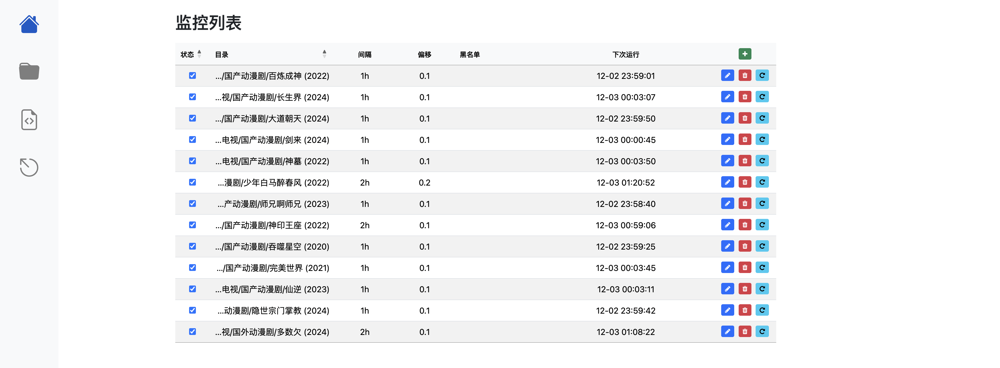
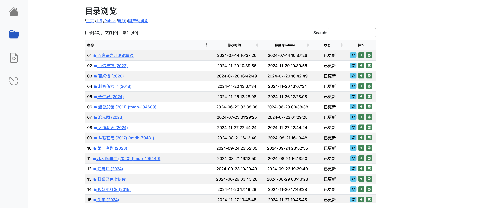
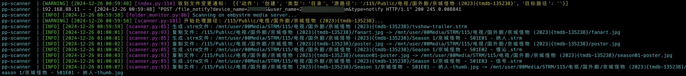

# partial-path-scanner

利用[python-clouddrive-client](https://github.com/ChenyangGao/web-mount-packs/tree/main/python-clouddrive-client)提供的clouddrive2 api/webhook来监控目录变化，然后进行plex/emby media server的局部扫描。

**定时遍历预览图**



**手动更新扫描预览图**



**基于clouddrive2的webhook实时监控日志**




## 免责声明

* 本项目处于开发中，不建议小白直接使用。  

## 依赖

* Python
* Flask
* Bootstrap
* python-clouddrive-client
* ...

## 用法

### 环境
**测试环境 1**
* QNAP x86_64
* Plex Media Server with docker
* clouddrive2添加115网盘，挂载到本地目录`/share/SSD1T/03cd2/115`，文件夹缓存期40s。  

**测试环境 2**
* Unraid 7.0.0-beta.2
* EmbyServer from app center
* clouddrive2添加115网盘，挂载到本地目录`/mnt/user/CloudDrive/115`，文件夹缓存期40s。  


### 部署

**clouddrive2中添加webhook.toml**  

> 注：基于webhook来实时监听文件变化属于clouddrive2会员功能！

如果你有实时监控的需求，请在clouddrive2的`config`目录下添加`webhook.toml`文件，内容如下：
```toml
[global_params]
base_url = "http://你的局域网ip:本程序的webui端口2024"
enabled = true

[global_params.default_headers]
content-type = "application/json"
user-agent = "clouddrive2/{version}"
authorization = "basic usernamepassword"

[file_system_watcher]
url = "{base_url}/file_notify?device_name={device_name}&user_name={user_name}&type={event_name}"
method = "POST"
enabled = true
body = '''
{
  "device_name": "{device_name}",
  "user_name": "{user_name}",
  "version": "{version}",
  "event_category": "{event_category}",
  "event_name": "{event_name}",
  "event_time": "{event_time}",
  "send_time": "{send_time}",
  "data": [
      {
        "action": "{action}",
        "is_dir": "{is_dir}",
        "source_file": "{source_file}",
        "destination_file": "{destination_file}"
      }
  ]
}
'''
[file_system_watcher.headers]
additional_header = "value"
```

一般而言，只需要修改`base_url`，保存后重启clouddrive2。

**部署容器**  

先拷贝项目中的`template/config.yaml`到`你的compose项目目录/config/config.yaml`，并按需修改（WEBUI的启动端口2024，默认登录用户名admin，密码admin等）。

再基于如下`docker-compose.yaml`构建docker容器:
```yaml
services:
  partial-path-scanner:
    image: zfhxi/partialpathscanner:beta
    container_name: pp-scanner
    network_mode: host
    restart: unless-stopped
    environment:
      - FLOWER_BASIC_AUTH=admin:admin # 启动flower时，监控后台任务的用户名及密码，便于查看任务状态
      - FLOWER_PORT=1024 # flower ui的端口
      - FLOWER_URL_PREFIX=/flower # 通过http://yourip:1024/flower/ 访问flower ui
    volumes:
      - ./config:/app/config
      - ./log:/app/log
      - /mnt/user/00Media/STRM:/mnt/user/00Media/STRM # strm生成目录的映射
    depends_on:
      - pps-redis
  pps-redis:
    image: redis:7.4.1
    container_name: pps-redis
    restart: always
    network_mode: bridge
    environment:
      - REDIS_ARGS="--user default --requirepass helloworld --appendonly yes"
    ports:
      - 6379:6379
    volumes:
      - ./redis_data:/data
```

打开`http://你的ip:2024`即可访问web ui（推荐PC端访问，因为没有做移动端UI适配）。

每次更改`config.yaml`文件后，需要重启容器。

**定时监控目录的运行逻辑**
1. 将监控目录的所有子目录的mtime属性存入数据库。
2. 定时任务每间隔特定时间来遍历监控目录，检查该目录及其子目录的mtime属性是否发生变化，若发生变化，则对该目录下的媒体路径进行扫描。  
3. 扫描时，根据配置文件中的`path_mapping`规则，将clouddrive2中的路径映射到plex/emby media server的路径。  

**实时监控目录的运行逻辑**
1. cd2检测到文件变更后，通过webhook发送post请求，将变更信息传递到本程序。
2. 当你使用`plex`、`emby`类型的媒体服务器时，本程序根据传递的信息，将相应目录映射后进行局部扫描。
3. 当你使用`embystrm`类型的媒体服务器时，本程序会根据传入的变更信息，先生成`.strm`文件，然后再局部扫描生成的strm文件。

**embystrm的补充说明**
假设config.yaml对strm的映射如下：
```yaml
root_mapping:
    # strm根目录的映射配置
    - src: /115/Public # 网盘115在cd2中的根路径
    dest: /mnt/user/00Media/STRM/115 # STRM存储根路径
    mount: /mnt/user/CloudDrive/115 # 网盘115通过cd2挂载到本地的根路
```
那么：
* 媒体文件：`/115/Public/电视/国外剧/京城怪物 (2023){tmdb-135238}/Season 1/京城怪物 - S01E01 - 纳人.strm`
* 会生成对应strm文件： `/mnt/user/00Media/STRM/115/电视/国外剧/京城怪物 (2023){tmdb-135238}/Season 1/京城怪物 - S01E01 - 纳人.strm`
* strm中的内容记录的是clouddrive2挂载到本地后，媒体文件在本地的路径：`/mnt/user/CloudDrive/115/电视/国外剧/京城怪物 (2023){tmdb-135238}/Season 1/京城怪物 - S01E01 - 纳人.mkv`


## nginx反向代理

```nginx
location / {
    proxy_pass http://127.0.0.1:2024;
    proxy_set_header Host $host;
    proxy_set_header X-Forwarded-For $proxy_add_x_forwarded_for;
    proxy_set_header X-Forwarded-Proto $scheme;
}
location /logs/get {
    proxy_pass http://127.0.0.1:2024/logs/get;
}
location /flower {
    rewrite ^/flower$ /flower/;
    proxy_pass http://127.0.0.1:1024;
}
```
访问`pps.yourdomain.com`即可访问web ui来添加监控目录, 访问`pps.yourdomain.com/flower/`即可访问flower ui查看后台任务状态。


## 局限性

**最近115风控得更加厉害了，建议cd2中115的maxQueriesPerSecond参数调小（如0.9以下）。**

## TODO

- [ ] find more bugs.
- [x] ~~阿里云盘目录的mtime不会随子文件新增而变化，需要额外的逻辑处理。~~（移除计划：开发者弃用阿里云盘）
- [x] 对某些目录提交mtime增量更新后台任务，偶尔执行失效。（开发环境和生产环境共用了同一个redis，参考[此处](https://blog.51cto.com/u_2371418/5166076)解决）
- [x] plex media server似乎不支持扫描xxx.mkv这种单个文件入库，需要扫描父目录。（引入isfile_based_scanning参数）


## 感谢

- [HuTa0kj/flask-template](https://github.com/HuTa0kj/flask-template)
- [tanlidoushen/CloudDriveAlistEmbyScripts](https://github.com/tanlidoushen/CloudDriveAlistEmbyScripts)